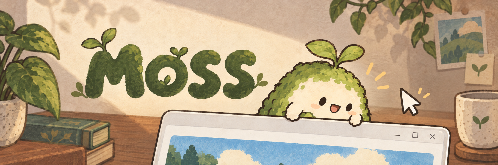
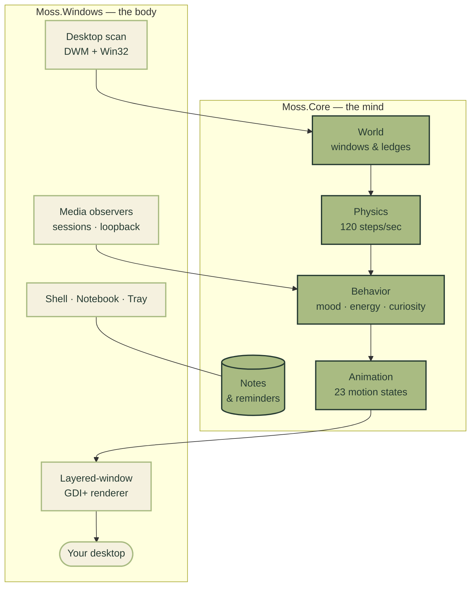

# Moss

**A living creature whose world is Windows.**

Moss is a tiny companion that lives on your desktop. It perches on your window ledges, watches your cursor go by, lets you grab it and throw it, dances when your music plays, and keeps a little notebook so you don't forget things. It asks for nothing — no account, no cloud, no setup beyond running one file.

[](LICENSE)
[](https://github.com/aryan-astra/Moss/actions/workflows/ci.yml)
[](https://github.com/aryan-astra/Moss/releases)
[](https://dotnet.microsoft.com/download/dotnet/8.0)
[](src/Moss.Windows)
[](src/Moss.Windows)

## Moss in numbers

| 7 | hand-tuned characters | 23 | motion states | 120 | physics steps every second |
| 18 | automated checks, green | 700 | ms notebook autosave | 0 | accounts, cloud calls, ads |

## Get going in a minute

1. Grab `Moss-1.2.0-windows-x64.zip` from the [Releases page](https://github.com/aryan-astra/Moss/releases) and unzip it anywhere. One file more your style? `Moss-1.2.0-windows-x64.exe` is the same build, ready to run.
2. Double-click **Moss.exe**. Say hi.
3. Drag it around. Rub its head. Right-click it. Open the **Notebook** and type `@timer 25m`, put the caret on the line, hit **Ctrl+Enter**.
4. Done with it? Tray → **Exit Moss**. To remove it entirely, run `uninstall-portable.ps1` and delete the folder.

## What a day with Moss looks like

- **Morning.** Moss wakes on a window ledge, stretches through a few of its 23 motion states, and watches your cursor while you work.
- **Afternoon.** You grab it mid-wander and toss it across the screen. It lands, rebounds, shakes it off. You pull its twig toy; it pulls back.
- **Evening.** Music comes on. Moss notices — really notices, from the actual playback session — climbs down, and dances. Hearts optional; petting helps.
- **Night.** You jot tomorrow's plan in the notebook, set `@remind tomorrow 9am call home`, confirm the preview, close the lid. Moss sleeps at 5 frames a second and sips almost nothing.

## Meet the residents

| | Who | Vibe |
|---|---|---|
| Moss | Woodland bean | Leaf ears, soft breathing, the original |
| Miso | Cat | Pointed ears, whiskers, curling tail, does things on her own terms |
| Pip | Dog | Floppy ears and collar, enthusiastic about everything, especially you |
| Lark | Bird | Crest and wings, light on its feet, first to notice music |
| Inky | Octopus | Eight waving arms, unbothered, excellent dancer |
| Clover | Rabbit | Long ears, big feet, gentle and a little shy |
| Puck | Penguin | Belly-first waddle, formal but friendly |

Everyone runs on the same engine with their own proportions, palette, personality mix and music player — headphones, CD, radio, cassette or turntable. Pick one in Customize; names, sizes and moods are remembered per pet.

## How Moss works



Two projects, one idea: `src/Moss.Core` simulates a physical little animal (gravity, springy grabs, ledge landings, moods, props, notes) with no idea what Windows is, and `src/Moss.Windows` plugs that animal into the real desktop — layered transparent windows, DWM geometry, media sessions, the task scheduler. `tests/Moss.Tests` keeps all 18 checks green.

## Private by design

- No accounts, no telemetry, no cloud inference, no ads.
- No screenshots, no clipboard reading, no file scanning, no browser scraping.
- No microphone recording — music awareness reads playback state and output levels, never records.
- Notes live in `%LOCALAPPDATA%\Moss`, on your disk, in your control.
- Media details and speaker analysis are opt-in and off by default.

## For developers

```powershell
git clone https://github.com/aryan-astra/Moss.git
cd Moss
./scripts/build.ps1
```

Needs the .NET 8 SDK (pinned in `global.json`). That one script restores, builds [`Moss.sln`](Moss.sln), runs the 18-check harness, and stages the portable ZIP, the single-file EXE and checksums under `artifacts/`. Releases are cut the same way by robots: push a `v1.*` tag matching `Directory.Build.props` and GitHub Actions does the rest. Bring your own creature too — a character is one validated `character.json` (see [`characters/character.schema.json`](characters/character.schema.json)).

## Simple outside, laboratory inside

Moss keeps two faces: the shell stays simple — Climbing, Construction, Animations and Mischief each offer Rare / Occasional / Frequent — while **Feature Lab** (tray → Feature Lab…) opens the workshop. Every behavior above has a manual trigger there (climb the left edge, build a house now, replay any of the 28 animations), plus exact timing, physics and behavior values, presets, a live event stream and a world inspector. Test Mode pauses autonomy so your triggers take priority, and every advanced value persists across restarts.

## Credits

Built with .NET 8, WinForms, NAudio and Markdig — attributions in [`licenses/`](licenses/). Brand artwork lives in [`assets/branding/`](assets/branding/).

MIT — see [LICENSE](LICENSE). Free forever, no strings attached.
